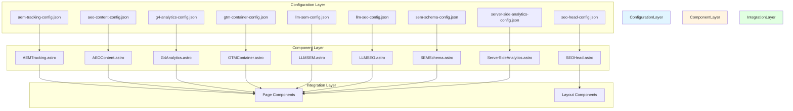
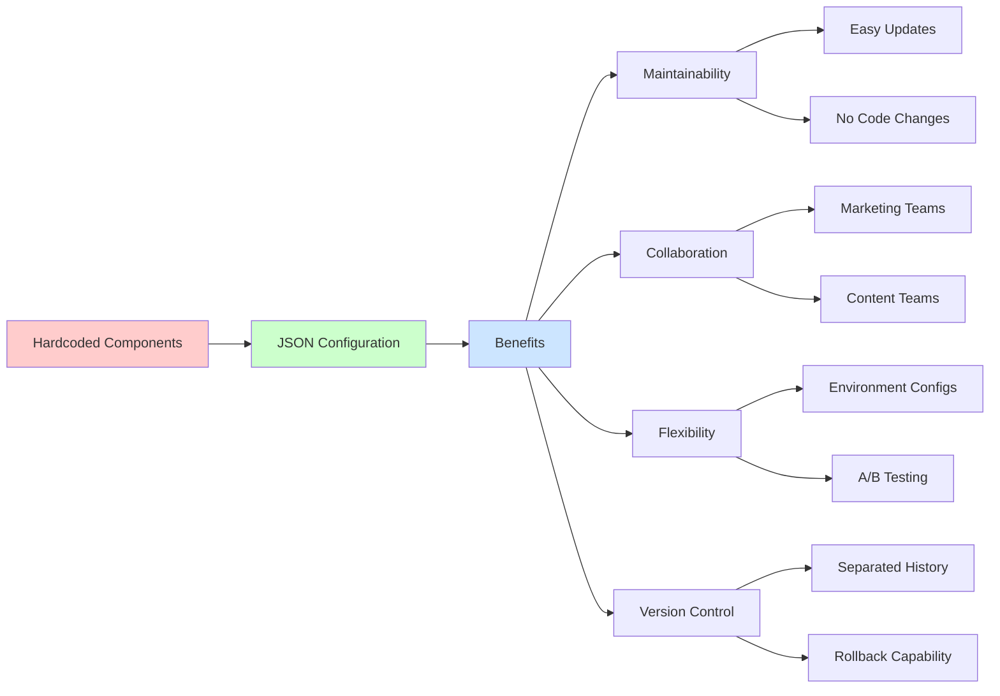
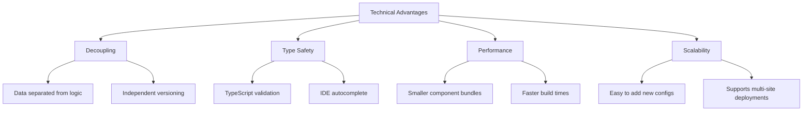
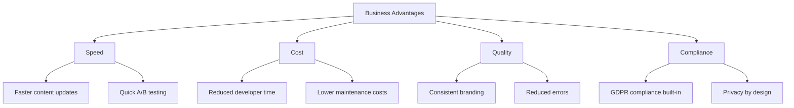

# Marketing Components Architecture

## Overview

This document describes the refactored marketing components architecture for the CrediScore landing page project. All marketing components have been refactored to use JSON configuration files, enabling better maintainability, collaboration, and flexibility.

## Components Architecture



## Value Proposition



## Feature Comparison

### Before Refactoring
- **Hardcoded Values**: All configuration embedded in component code
- **Code Changes Required**: Marketing teams needed developer assistance
- **Environment Coupling**: Same config across all environments
- **Maintenance Burden**: Risk of breaking code during content updates
- **Limited Flexibility**: Difficult to test different configurations

### After Refactoring
- **JSON Configuration**: All data in separate configuration files
- **Self-Service**: Marketing teams can update without developer help
- **Environment Flexibility**: Different configs per environment
- **Safe Updates**: Content updates don't risk code integrity
- **Easy Testing**: Simple to create configuration variants

## Component Features

### 1. AEMTracking (Server-Side Analytics)
**Purpose**: Server-side analytics with privacy compliance

**Key Features**:
- Automatic page view tracking via middleware
- Session management with HttpOnly cookies
- IP anonymization for GDPR compliance
- Bot detection and filtering
- Performance metrics collection
- API endpoint for client-side events

**Value**: Privacy-compliant analytics that can't be blocked by ad-blockers

### 2. AEOContent (Answer Engine Optimization)
**Purpose**: Structured data for AI-powered search engines

**Key Features**:
- FAQ schema with intent classification
- HowTo guides with step-by-step instructions
- Definitions with examples and context
- Article schema with metadata
- JSON-LD structured data generation

**Value**: Optimized for LLM and AI-powered search engines

### 3. G4Analytics (Google Analytics 4)
**Purpose**: Google Analytics 4 integration

**Key Features**:
- Enhanced measurement configuration
- Custom dimensions and metrics
- E-commerce tracking support
- Privacy controls (ad personalization)
- Performance monitoring
- Core Web Vitals tracking

**Value**: Comprehensive GA4 implementation with advanced features

### 4. GTMContainer (Google Tag Manager)
**Purpose**: Google Tag Manager integration

**Key Features**:
- DataLayer management
- Automatic tracking (scroll, time, visibility)
- Consent management (GDPR compliant)
- SPA navigation support
- Performance metrics
- Cookie configuration

**Value**: Centralized tag management with advanced tracking

### 5. LLMSEM (LLM Search Engine Marketing)
**Purpose**: LLM-optimized SEM content and schema

**Key Features**:
- Semantic keyword optimization
- Intent-based FAQ classification
- Competitive comparisons
- Process documentation
- Entity extraction
- Custom schema extensions

**Value**: Optimized for AI-powered search and understanding

### 6. LLMSEO (LLM Search Engine Optimization)
**Purpose**: LLM-optimized SEO content

**Key Features**:
- Expertise and services documentation
- Benefits and features listing
- Use case documentation
- Target audience definition
- Differentiators
- FAQ with context

**Value**: Better visibility in AI-powered search results

### 7. SEMSchema (Schema.org Structured Data)
**Purpose**: Rich schema markup for search engines

**Key Features**:
- Organization schema
- Local business schema
- Service schema
- FAQ schema
- Geo location data
- Opening hours
- Payment information

**Value**: Enhanced search result presentation and local SEO

### 8. SEOHead (Meta Tags and SEO)
**Purpose**: Complete SEO meta tag management

**Key Features**:
- Page meta tags (title, description, keywords)
- Open Graph for social sharing
- Twitter card configuration
- Geographic meta tags
- Performance optimization (DNS prefetch, preconnect)
- Favicon management

**Value**: Comprehensive SEO and social media optimization

### 9. ServerSideAnalytics (Client-Side Analytics)
**Purpose**: Lightweight client-side event tracking

**Key Features**:
- Scroll depth tracking
- Time on page milestones
- Visibility tracking
- Consent management (GDPR)
- Session management
- Performance metrics

**Value**: Captures events that can't be tracked server-side

## Advantages

### Technical Advantages


### Business Advantages


## Necessity Analysis

### Why These Components Are Necessary

#### 1. **Business Requirements**
- **CrediScore Brand**: Professional fintech presence requires sophisticated marketing
- **Venezuelan Market**: Local SEO and trust signals are critical
- **Competitive Differentiation**: Advanced analytics and SEO provide competitive edge
- **Growth Strategy**: Data-driven marketing decisions require comprehensive tracking

#### 2. **Technical Requirements**
- **Modern SEO**: Search engines expect structured data and rich snippets
- **AI Search**: LLM-powered search requires semantic optimization
- **Privacy Compliance**: GDPR/CCPA require consent management and data minimization
- **Performance**: Core Web Vitals impact search rankings

#### 3. **User Experience**
- **Fast Loading**: Performance optimization improves user experience
- **Social Sharing**: Open Graph ensures proper social media previews
- **Mobile Optimization**: Responsive meta tags for mobile devices
- **Accessibility**: Proper meta tags improve screen reader experience

#### 4. **Analytics Requirements**
- **Data-Driven Decisions**: Comprehensive tracking enables informed marketing
- **Attribution**: Multi-channel attribution requires advanced tracking
- **Conversion Optimization**: Detailed analytics support conversion rate optimization
- **ROI Measurement**: Accurate tracking enables ROI calculation

### Alternative Approaches Considered

#### Option 1: No Marketing Components
**Pros**: Simple, no maintenance
**Cons**: 
- No SEO optimization
- No analytics data
- Poor social media presence
- Limited growth potential
**Verdict**: Not viable for a fintech startup

#### Option 2: Third-Party Marketing Tools
**Pros**: Quick setup, managed service
**Cons**:
- Recurring costs
- Limited customization
- Vendor lock-in
- Data privacy concerns
**Verdict**: Viable but less flexible and more expensive

#### Option 3: Custom Implementation (Current Approach)
**Pros**:
- Full control
- No ongoing costs
- Customizable to exact needs
- Data ownership
- Privacy compliance
**Cons**:
- Higher initial investment
- Requires maintenance
**Verdict**: Best long-term solution for CrediScore

## Implementation Summary

### Files Created
```
src/data/
├── aem-tracking-config.json
├── aeo-content-config.json
├── g4-analytics-config.json
├── gtm-container-config.json
├── llm-sem-config.json
├── llm-seo-config.json
├── sem-schema-config.json
├── seo-head-config.json
└── server-side-analytics-config.json

src/components/marketing/
├── AEMTracking.astro (refactored)
├── AEOContent.astro (refactored)
├── G4Analytics.astro (refactored)
├── GTMContainer.astro (refactored)
├── LLMSEM.astro (refactored)
├── LLMSEO.astro (refactored)
├── SEMSchema.astro (refactored)
├── SEOHead.astro (refactored)
└── ServerSideAnalytics.astro (refactored)

src/middleware/
└── analytics.ts (new)

src/pages/api/
└── analytics.ts (new)

src/pages/
└── analytics-dashboard.astro (new)
```

### Configuration Pattern
All components follow the same pattern:
1. Import JSON configuration file
2. Merge with props (props override defaults)
3. Use spread operator for clean merging
4. Maintain type safety with TypeScript assertions

### Usage Example
```astro
import SEOHead from '../components/marketing/SEOHead.astro';
import AEOContent from '../components/marketing/AEOContent.astro';

<SEOHead 
  page={{ 
    title: "Custom Title",
    description: "Custom Description"
  }}
/>
<AEOContent />
```

## Maintenance Guidelines

### Updating Content
1. Edit the JSON configuration file
2. No code changes required
3. Changes take effect on next build/deploy

### Adding New Components
1. Create JSON config file in `src/data/`
2. Create component in `src/components/marketing/`
3. Follow the established pattern
4. Add TypeScript type definitions
5. Import and use JSON configuration

### Environment-Specific Configs
Create separate config files:
- `config.development.json`
- `config.production.json`
- `config.staging.json`

Import based on environment:
```typescript
const config = import.meta.env.DEV 
  ? devConfig 
  : prodConfig;
```

## Implementation Know-How

### Quick Start Guide

#### 1. Basic Setup
```astro
---
import SEOHead from '../components/marketing/SEOHead.astro';
import AEOContent from '../components/marketing/AEOContent.astro';
import SEMSchema from '../components/marketing/SEMSchema.astro';
import ServerSideAnalytics from '../components/marketing/ServerSideAnalytics.astro';
---

<SEOHead />
<AEOContent />
<SEMSchema />
<ServerSideAnalytics />
```

#### 2. Customizing Configuration
Override default configuration by passing props:
```astro
<SEOHead 
  page={{
    title: "Custom Page Title",
    description: "Custom description",
    keywords: ["custom", "keywords"]
  }}
/>
```

### Component-Specific Implementation

#### SEOHead Implementation

**Usage**:
```astro
<SEOHead 
  page={{
    title: "Your Title",
    description: "Your description",
    url: "https://yourdomain.com/page",
    type: "website",
    locale: "es_VE"
  }}
  openGraph={{
    siteName: "Your Site",
    image: {
      url: "https://yourdomain.com/og-image.jpg",
      alt: "Image description",
      width: 1200,
      height: 630
    }
  }}
  twitter={{
    card: "summary_large_image",
    site: "@yourhandle"
  }}
/>
```

**Key Points**:
- Always include title and description
- Use high-quality images (1200x630 for OG)
- Set correct locale for international SEO
- Configure robots meta for staging environments

#### AEOContent Implementation

**Usage**:
```astro
<AEOContent 
  content={{
    faq: [
      {
        question: "Your question?",
        answer: "Your answer",
        category: "general",
        keywords: ["keyword1", "keyword2"]
      }
    ],
    howTo: [
      {
        name: "How to do X",
        description: "Step-by-step guide",
        steps: ["Step 1", "Step 2", "Step 3"],
        estimatedTime: "PT10M"
      }
    ]
  }}
/>
```

**Key Points**:
- Use intent classification for questions
- Include context for LLM understanding
- Add keywords for semantic optimization
- Structure howTo steps clearly

#### SEMSchema Implementation

**Usage**:
```astro
<SEMSchema 
  entity={{
    name: "Your Business",
    description: "Business description",
    url: "https://yourdomain.com",
    telephone: "+58-212-1234567",
    email: "contact@yourdomain.com",
    address: {
      streetAddress: "Your Address",
      addressLocality: "City",
      addressRegion: "State",
      addressCountry: "VE"
    },
    areaServed: ["VE", "CO"]
  }}
/>
```

**Key Points**:
- Include complete business information
- Use ISO country codes
- Add geo coordinates for local SEO
- Configure opening hours accurately

#### ServerSideAnalytics Implementation

**Usage**:
```astro
<ServerSideAnalytics 
  config={{
    trackScroll: true,
    trackTime: true,
    trackClicks: true,
    trackVisibility: true,
    debug: import.meta.env.DEV
  }}
/>
```

**Key Points**:
- Enable debug mode in development only
- Disable tracking for privacy pages
- Use with consent management
- Test with browser DevTools

### Configuration File Management

#### Creating Custom Configurations

1. **Copy default config**:
```bash
cp src/data/seo-head-config.json src/data/seo-head-custom.json
```

2. **Modify values**:
```json
{
  "defaultPage": {
    "title": "Your Custom Title",
    "description": "Your custom description"
  }
}
```

3. **Import custom config**:
```astro
import customConfig from '../../data/seo-head-custom.json';
```

#### Environment-Specific Configurations

**Development**:
```json
{
  "defaultOutput": {
    "emitJSONLD": true,
    "prettyPrint": true,
    "minify": false
  }
}
```

**Production**:
```json
{
  "defaultOutput": {
    "emitJSONLD": true,
    "prettyPrint": false,
    "minify": true
  }
}
```

### Testing and Validation

#### SEO Validation Tools

1. **Google Rich Results Test**: https://search.google.com/test/rich-results
2. **Schema Validator**: https://validator.schema.org/
3. **Facebook Sharing Debugger**: https://developers.facebook.com/tools/debug/
4. **Twitter Card Validator**: https://cards-dev.twitter.com/validator

#### Analytics Testing

1. **Google Tag Assistant**: Chrome extension for GTM/GA4 debugging
2. **Network Tab**: Check API calls to `/api/analytics`
3. **Console Logs**: Enable debug mode to see tracking events
4. **Cookie Inspector**: Verify session cookies are set

### Common Implementation Patterns

#### Multi-Language Setup

Create language-specific configs:
```
src/data/
├── seo-head-config.json (default)
├── seo-head-config-es.json
├── seo-head-config-en.json
└── seo-head-config-pt.json
```

Usage:
```astro
const lang = 'es';
const config = await import(`../../data/seo-head-config-${lang}.json`);
```

#### A/B Testing Configurations

Create variant configs:
```
src/data/
├── seo-head-config.json (control)
├── seo-head-config-variant-a.json
└── seo-head-config-variant-b.json
```

#### Dynamic Configuration

Load configuration based on route:
```astro
---
const config = await import(`../../data/${Astro.params.page}-config.json`);
---
```

### Integration Patterns

#### Layout Integration
```astro
---
import SEOHead from '../components/marketing/SEOHead.astro';
import SEMSchema from '../components/marketing/SEMSchema.astro';
---

<SEOHead />
<SEMSchema />
<slot />
```

#### Page-Specific Overrides
```astro
---
import SEOHead from '../components/marketing/SEOHead.astro';

const pageMeta = {
  title: "About CrediScore",
  description: "Learn about our mission",
  keywords: ["about", "mission", "values"]
};
---

<SEOHead page={pageMeta} />
```

#### Conditional Component Loading
```astro
---
import SEOHead from '../components/marketing/SEOHead.astro';
import ServerSideAnalytics from '../components/marketing/ServerSideAnalytics.astro';

const enableAnalytics = import.meta.env.PROD;
---

<SEOHead />
{enableAnalytics && <ServerSideAnalytics />}
```

### Troubleshooting

#### Common Issues

**Issue**: Schema validation errors
- **Solution**: Check JSON structure matches TypeScript types
- **Tool**: Use schema.org validator

**Issue**: Analytics not tracking
- **Solution**: Enable debug mode, check console logs
- **Tool**: Browser DevTools Network tab

**Issue**: Social media previews not showing
- **Solution**: Verify OG image URL is accessible
- **Tool**: Facebook Sharing Debugger

**Issue**: Configuration not loading
- **Solution**: Check import path and JSON syntax
- **Tool**: Browser console for import errors

#### Debug Mode

Enable debug mode for troubleshooting:
```json
{
  "defaultConfig": {
    "debug": true
  }
}
```

Or override in component:
```astro
<ServerSideAnalytics config={{ debug: true }} />
```

### Best Practices

#### 1. Configuration Management
- Keep JSON files formatted (2-space indentation)
- Use descriptive keys and values
- Add comments for complex configurations
- Version control configuration changes

#### 2. SEO Best Practices
- Keep titles under 60 characters
- Keep descriptions under 160 characters
- Use unique titles per page
- Include target keywords naturally
- Use semantic HTML structure

#### 3. Analytics Best Practices
- Don't track sensitive data
- Respect user consent
- Use meaningful event names
- Test tracking implementation
- Regular audit tracking configuration

#### 4. Performance Best Practices
- Minify JSON in production
- Lazy load analytics scripts
- Use async loading where possible
- Optimize image sizes
- Enable compression

#### 5. Privacy Best Practices
- Anonymize IP addresses
- Implement consent management
- Respect Do Not Track
- Secure cookies (HttpOnly, Secure, SameSite)
- Data retention policies

### Migration Guide

#### From Hardcoded to JSON Configuration

**Before**:
```astro
const defaultConfig = {
  title: "Hardcoded Title",
  description: "Hardcoded description"
};
```

**After**:
```astro
import config from '../../data/config.json';

const defaultConfig = config.defaultPage;
```

**Steps**:
1. Extract hardcoded values to JSON
2. Create config file in `src/data/`
3. Update component to import config
4. Test configuration loading
5. Remove hardcoded values
6. Commit changes

### Advanced Topics

#### Custom Schema Extensions

Add custom schema properties:
```json
{
  "customProperties": [
    {
      "name": "customProperty",
      "value": "customValue"
    }
  ]
}
```

#### Dynamic Schema Generation

Generate schema based on page content:
```astro
---
const pageData = await fetch('https://api.example.com/content').then(r => r.json());
const dynamicSchema = {
  entity: {
    name: pageData.title,
    description: pageData.description
  }
};
---

<SEMSchema entity={dynamicSchema.entity} />
```

#### Analytics Event Customization

Add custom tracking events:
```typescript
window.lightweightAnalytics.track('custom_event', {
  category: 'engagement',
  label: 'button_click',
  value: 1
});
```

### Resources

#### Documentation Links
- [Schema.org Documentation](https://schema.org/)
- [Google Analytics 4 Guide](https://developers.google.com/analytics/devguides)
- [Open Graph Protocol](https://ogp.me/)
- [Twitter Cards](https://developer.twitter.com/en/docs/twitter-for-websites/cards/overview/abouts-cards)

#### Tools
- [Mermaid Live Editor](https://mermaid.live/)
- [JSON Validator](https://jsonlint.com/)
- [TypeScript Playground](https://www.typescriptlang.org/play)

#### Learning Resources
- [SEO Best Practices](https://developers.google.com/search/docs)
- [Structured Data Guidelines](https://developers.google.com/search/docs/appearance/structured-data)
- [Web Vitals](https://web.dev/vitals/)
- [Privacy Guidelines](https://developers.google.com/privacy/gdpr)

## Conclusion

The refactored marketing components architecture provides a robust, maintainable, and flexible foundation for CrediScore's marketing technology stack. The JSON configuration approach enables:

- **Non-technical team members** to update marketing content
- **Faster iteration** on marketing campaigns
- **Better SEO** through structured data and meta tags
- **Comprehensive analytics** with privacy compliance
- **Future-proofing** for AI-powered search engines

This architecture is **necessary** for CrediScore because:
1. Fintech requires trust and credibility (SEO, schema, professional presentation)
2. Venezuelan market needs local optimization (geo tags, local business schema)
3. Growth requires data-driven decisions (comprehensive analytics)
4. Compliance is mandatory (GDPR, privacy by design)
5. Competitive advantage requires advanced features (AI optimization, structured data)

The investment in this architecture will pay dividends through improved search rankings, better user acquisition, more effective marketing campaigns, and reduced long-term maintenance costs.
